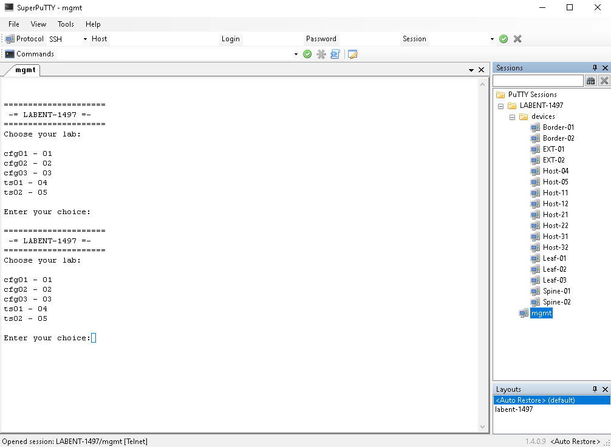

Get started
===============

Please, connect to lab via one of the presented connection options and then proceed to **Connecting to lab devices** section.

WIL workstation option
**********************

If you are sitting on WIL workstation, please click **Connect VPN** button.

BYOD Option
***********

Please connect to the lab with **Cisco AnyConnect** (you can get server name and credentials from WIL portal):

#. Start **Cisco AnyConnect** on your laptop
#. Copy the **Host** URL from the **AnyConnect Credentials** and then paste it in the **URL Connection box** in the **AnyConnect** login window.
#. Click connect

    .. image:: assets/anyconnect.png

#. If you get a connection error, remove the ``https://`` part of the URL and try the connection again.
#. Copy a User ID and the password from the **AnyConnect Credentials** and then paste each into the **Cisco AnyConnect** login window.
#. Click **OK**
#. Click **Accept** on the window confirming your connection.
#. When connected to your AnyConnect VPN session, the AnyConnect VPN icon is displayed in the system tray (Windows) or task bar (Mac).
#. To view connection details or to disconnect, click the AnyConnect VPN icon and then choose Disconnect.

Connecting to lab devices
*************************

After connecting to the VPN of the lab pod, use RDP to connect to the jumphost workstation.

    **IP Address**: 198.18.133.36

    **Credentials**: admin / C1sco12345

On the jumphost workstation you have all required sessions preconfigured for use in the **SuperPutty** session manager. 

In the **SupperPutty**, you can find list of saved session in **LABENT-1497** folder. Via ``mgmt`` session, you can access **lab manager**. Please, use **lab manager** to initialize lab devices with the config for corresponding tasks.

You can open connections to all lab devices by selecting **Connect All** in the right-click menu on **devices** folder.

.. note:: 
    See the network topology and follow the guide to complete the lab tasks. At the beginning of each task come back to **lab manager** session to re-initialize lab devices with config for that specific task.