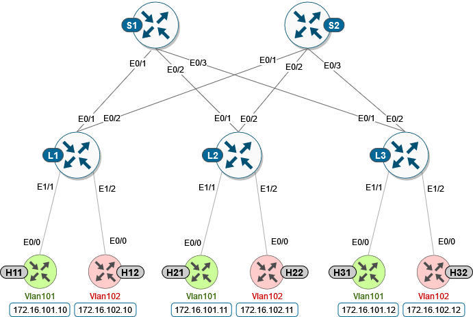
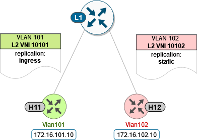

Task CFG01: Configure L2/L3 + Spines EVPN connectivity with Spines
==================================================================

In this task, we will be exploring the example of the Leafs+Spines topology with the addition of L3 VNI.

An EVPN VXLAN Layer 3 overlay network allows host devices in different Layer 2 networks to send Layer 3 or routed traffic to each other. The network forwards the routed traffic using a Layer 3 virtual network instance (VNI) and an IP VRF.

To get started, please select in ``lab manager`` option ``01`` to initialize lab devices.

.. note::

    At the beginning of the task the following protocols are pre-configured and running:
        * IGP is UP
        * BGP is up
        * Multicast is configured
    
    In this lab task, we will mainly focus on L3 part of the configuration. The L2 parts like L2 VNI, EVI, VNI are already preconfigured and running. At the relevant steps, there will also provide reference of pre applied L2 configuration for your awareness. 

Step 1: Create VRF
******************

First step to configure L3 VNI routing is to have VRF defined with RD (route distinguisher) and import/export RTs (route targets) correctly configured.

.. note::

    ``stitching`` is a new keyword added to the existing route-target configuration to specify the route targets to be used when doing EVPN related processing.

    EVPN->VRF
        EVPN routes that contain RT matching an import “stitching RT” specified in a VRF configuration are accepted by the router and imported into the corresponding BGP L3VPN VRF. The resulting L3VPN prefix retains the same route target. 

    VRF->EVPN
        L3VPN routes that are imported into EVPN via “advertise l2vpn evpn” contain RTs specified by that VRF export “stitching RT”. Any original route targets are removed.

    The existing RT configuration does not affect EVPN related processing, and you can have the same RT values for both base and VXLAN EVPN routes. 

VRF name is ``green``. RT ``1:1`` is to be used for base route target configuration and RT ``10:10`` for EVPN related processing.

L1/L2/L3 nodes

.. code-block:: console
   :linenos:
   :emphasize-lines: 6,7

    conf t
    !
    vrf def green
     rd 1:1
     address-family ipv4 unicast
      route-target both 1:1
      route-target both 10:10 stitching

You can check results with the ``show vrf detail <VRF_Name>`` command, e.g.:

L1 node

.. code-block:: console
   :linenos:
   :emphasize-lines: 9,11,13,15
   :class: highlight-command
    
    cfg01-L1#show vrf detail green
    VRF green (VRF Id = 1); default RD 1:1; default VPNID <not set>
    New CLI format, supports multiple address-families
    Flags: 0x180C
    No interfaces
    Address family ipv4 unicast (Table ID = 0x1):
    Flags: 0x0
    Export VPN route-target communities
        RT:1:1
    Import VPN route-target communities
        RT:1:1
    Export VPN route-target stitching communities
        RT:10:10
    Import VPN route-target stitching communities
        RT:10:10
    No import route-map
    No global export route-map
    No export route-map

Step 2: Configure MAC Aliasing for the distributed anycast gateway
******************************************************************

.. note::

    Distributed anycast gateway is a default gateway addressing mechanism in a BGP EVPN VXLAN fabric.

    This feature enables the use of the same gateway IP and MAC address across all the Leafs in an EVPN VXLAN network, to ensure that every Leaf functions as the default gateway for the workloads directly connected to it. The feature facilitates flexible workload placement, host mobility, and optimal traffic forwarding across the BGP EVPN VXLAN fabric. 

In our lab scenario we are using ``MAC aliasing``, which allows the Leafs to advertise their VLAN MAC addresses as the gateway MAC addresses to all the other Leafs in the network. The Leafs in the network store the advertised MAC address as a gateway MAC address provided their VLAN IP address matches with the gateway IP address.

Alternative way (not shown in the lab scenarios) would be to manually configure the same MAC address on the VLAN interfaces of all Leaf switches in the network. 

L1/L2/L3 nodes

.. code-block:: console
    :linenos:

    conf t
    !
    l2vpn evpn
     default-gateway advertise 

Verification output is part of the ``sh l2vpn evpn summary`` command:

.. code-block:: console
    :linenos:
    :emphasize-lines: 2,6,10
    :class: highlight-command highlight-command-9 highlight-command-15

    cfg01-L1#show l2vpn evpn summary | include Default
    Advertise Default Gateway: Yes
    Default Gateway Addresses: 0

    cfg01-L2#show l2vpn evpn summary | include Default
    Advertise Default Gateway: Yes
    Default Gateway Addresses: 0

    cfg01-L3#show l2vpn evpn summary | include Default
    Advertise Default Gateway: Yes
    Default Gateway Addresses: 0

.. note:: 

    L2VPN EVPN instance was already preconfigured on device with global replication mode set to ingress (unicast replication) along with two EVI instances: 101 with ingress (unicast) replication and 102 with static (multicast) replication mode.

    .. code-block:: console
        :linenos:

        l2vpn evpn
         replication-type ingress
         router-id Loopback1
         !
         l2vpn evpn instance 101 vlan-based
          encapsulation vxlan
         !
         l2vpn evpn instance 102 vlan-based
          encapsulation vxlan
          replication-type static

Step 3: Create VNI to vlan stitching for vlan901 (L3VNI), create SVIs for L2VNIs and L3VNI
******************************************************************************************

At this step, we create vlan 901 and SVI 901 to be mapped to L3VNI 50901. Similarly, we create SVIs for L2VNIs for routing between L2 domains. 

    * All SVI interfaces are part of “green” VRF. 
    * For L3VNI SVI make sure to enable IP processing on the Loopback1 interface without assigning an explicit IP address to the SVI.

.. list-table::
    :widths: 33 33 33
    :header-rows: 1
    :width: 100%

    * - VLAN
      - VNI
      - IP Address
    * - 101
      - 10101
      - 172.16.101.1
    * - 102
      - 10102
      - 172.16.102.1
    * - 901
      - 50901
      - ip unnumbered lo0

.. note::

    Same gateway IP and MAC address are used for L2VNI SVI interfaces across all the Leafs, to make a distributed anycast gateway.

L1/L2/L3 nodes

.. code-block:: console
    :linenos:
    :emphasize-lines: 8,13,18
    :class: emphasize-hll-16 emphasize-hll-25 emphasize-hll-34

    conf t
    !
    vlan 901
    !
    vlan configuration 901
     member vni 50901
    !
    interface Vlan101
     vrf forwarding green
     ip address 172.16.101.1 255.255.255.0
     no shut
    !
    interface Vlan102
     vrf forwarding green
     ip address 172.16.102.1 255.255.255.0
     no shut
    !
    interface vlan901
     vrf forwarding green
     ip unnumbered lo1
     no autostate
     no shut

.. note::

    Vlan 101 and 102 were already preconfigured along with corresponding VLAN to VNI mappings.

    .. code-block:: console
        :linenos:

        vlan 101,102
        !
        vlan configuration 101
         member evpn-instance 101 vni 10101
        vlan configuration 102  
         member evpn-instance 102 vni 10102

Step 4: Configure BGP for VRF
*****************************

For the VRF we need to advertise Layer 2 VPN EVPN routes within a tenant VRF, which can be done with ``advertise l2vpn evpn`` command under the corresponding BGP address-family on all Leafs. 

L1/L2/L3 nodes

.. code-block:: console
    :linenos:

    conf t
    !
    router bgp 65001
     address-family ipv4 unicast vrf green
      advertise l2vpn evpn 

Step 5: Add L3 SVI to NVE interface
***********************************

Finally, on the NVE interface the L3VNI has to be associated with the VRF ``green``, to indicate that it is being used for routing. 

.. code-block:: console
    :linenos:

    conf t
    !
    interface nve1
     member vni 50901 vrf green

.. note:: 

    Corresponding L2 VNI configuration of NVE interface was already preconfigured for you. As you can see below, VNI 10101 was configured with ingress (unicast) replication and VNI 10102 was configured with multicast (static) replication. 

    .. code-block:: console
        :linenos:

        interface nve1
         source-interface Loopback1
         host-reachability protocol bgp
         member vni 10101 ingress-replication
         member vni 10102 mcast-group 225.0.1.102

Step 6: Verification
***********************************

At this stage of the lab, we should be able to ping between the hosts located in different vlans since we enabled routing between different subnets via L3 VNI 50901 (Vlan901).

H1 node

.. code-block:: console
    :linenos:
    :class: highlight-command highlight-command-16 highlight-command-29 highlight-command-42

    cfg01-H1#ping vrf h1 172.16.102.11 source 172.16.101.10
    Type escape sequence to abort.
    Sending 5, 100-byte ICMP Echos to 172.16.102.11, timeout is 2 seconds:
    Packet sent with a source address of 172.16.101.10
    !!!!!
    Success rate is 100 percent (5/5), round-trip min/avg/max = 1/1/1 ms

    cfg01-H1#ping vrf h1 172.16.102.12 source 172.16.101.10
    Type escape sequence to abort.
    Sending 5, 100-byte ICMP Echos to 172.16.102.12, timeout is 2 seconds:
    Packet sent with a source address of 172.16.101.10
    .!!!!
    Success rate is 80 percent (4/5), round-trip min/avg/max = 1/1/1 ms

    cfg01-H1#ping vrf h2 172.16.101.11 source 172.16.102.10
    Type escape sequence to abort.
    Sending 5, 100-byte ICMP Echos to 172.16.101.11, timeout is 2 seconds:
    Packet sent with a source address of 172.16.102.10
    !!!!!
    Success rate is 100 percent (5/5), round-trip min/avg/max = 1/1/1 ms

    cfg01-H1#ping vrf h2 172.16.101.12 source 172.16.102.10
    Type escape sequence to abort.
    Sending 5, 100-byte ICMP Echos to 172.16.101.12, timeout is 2 seconds:
    Packet sent with a source address of 172.16.102.10
    !!!!!
    Success rate is 100 percent (5/5), round-trip min/avg/max = 1/1/3 ms

H2 node

.. code-block:: console
    :linenos:
    :class: highlight-command highlight-command-16 highlight-command-29 highlight-command-42

    cfg01-H2#ping vrf h1 172.16.102.10 source 172.16.101.11
    Type escape sequence to abort.
    Sending 5, 100-byte ICMP Echos to 172.16.102.10, timeout is 2 seconds:
    Packet sent with a source address of 172.16.101.11
    !!!!!
    Success rate is 100 percent (5/5), round-trip min/avg/max = 1/1/1 ms

    cfg01-H2#ping vrf h1 172.16.102.12 source 172.16.101.11
    Type escape sequence to abort.
    Sending 5, 100-byte ICMP Echos to 172.16.102.12, timeout is 2 seconds:
    Packet sent with a source address of 172.16.101.11
    !!!!!
    Success rate is 100 percent (5/5), round-trip min/avg/max = 1/1/2 ms

    cfg01-H2#ping vrf h2 172.16.101.10 source 172.16.102.11
    Type escape sequence to abort.
    Sending 5, 100-byte ICMP Echos to 172.16.101.10, timeout is 2 seconds:
    Packet sent with a source address of 172.16.102.11
    !!!!!
    Success rate is 100 percent (5/5), round-trip min/avg/max = 1/1/1 ms

    cfg01-H2#ping vrf h2 172.16.101.12 source 172.16.102.11
    Type escape sequence to abort.
    Sending 5, 100-byte ICMP Echos to 172.16.101.12, timeout is 2 seconds:
    Packet sent with a source address of 172.16.102.11
    !!!!!
    Success rate is 100 percent (5/5), round-trip min/avg/max = 1/1/2 ms

H3 node 

.. code-block:: console
    :linenos:
    :class: highlight-command highlight-command-16 highlight-command-29 highlight-command-42

    cfg01-H3#ping vrf h1 172.16.102.10 source 172.16.101.12
    Type escape sequence to abort.
    Sending 5, 100-byte ICMP Echos to 172.16.102.10, timeout is 2 seconds:
    Packet sent with a source address of 172.16.101.12
    !!!!!
    Success rate is 100 percent (5/5), round-trip min/avg/max = 1/1/1 ms

    cfg01-H3#ping vrf h1 172.16.102.11 source 172.16.101.12
    Type escape sequence to abort.
    Sending 5, 100-byte ICMP Echos to 172.16.102.11, timeout is 2 seconds:
    Packet sent with a source address of 172.16.101.12
    !!!!!
    Success rate is 100 percent (5/5), round-trip min/avg/max = 1/1/2 ms

    cfg01-H3#ping vrf h2 172.16.101.10 source 172.16.102.12
    Type escape sequence to abort.
    Sending 5, 100-byte ICMP Echos to 172.16.101.10, timeout is 2 seconds:
    Packet sent with a source address of 172.16.102.12
    !!!!!
    Success rate is 100 percent (5/5), round-trip min/avg/max = 1/1/2 ms

    cfg01-H3#ping vrf h2 172.16.101.11 source 172.16.102.12
    Type escape sequence to abort.
    Sending 5, 100-byte ICMP Echos to 172.16.101.11, timeout is 2 seconds:
    Packet sent with a source address of 172.16.102.12
    !!!!!
    Success rate is 100 percent (5/5), round-trip min/avg/max = 1/1/2 ms

Let’s now verify state of control plane on our devices. As you can see below, NVE interface state is Up. In terms of EVI 101 and 102, we can see that state is ``established``, which means that EVI was successfully provisioned on device. From the outputs, we can also verify L2 and L3 VNI information’s for corresponding EVI.

L1 node

.. code-block:: console
    :linenos:
    :emphasize-lines: 2,3,5,14,21,25,26,30,31,51,58,62,63,67,68
    :class: highlight-command highlight-command-13 highlight-command-80 emphasize-hll-37 emphasize-hll-44 emphasize-hll-45 emphasize-hll-52 emphasize-hll-53 emphasize-hll-104 emphasize-hll-111 emphasize-hll-112 emphasize-hll-119 emphasize-hll-120

    cfg01-L1#show nve int nve1
    Interface: nve1, State: Admin Up, Oper Up, Encapsulation: Vxlan,
    BGP host reachability: Enable, VxLAN dport: 4789
    VNI number: L3CP 1 L2CP 2 L2DP 0
    source-interface: Loopback1 (primary:10.1.254.3 vrf:0)
    tunnel interface: Tunnel0

    cfg01-L1#show l2vpn evpn evi 101 detail
    EVPN instance:       101 (VLAN Based)
    RD:                10.1.255.3:101 (auto)
    Import-RTs:        65001:101
    Export-RTs:        65001:101
    Per-EVI Label:     none
    State:             Established
    Replication Type:  Ingress (global)
    Encapsulation:     vxlan
    IP Local Learn:    Enabled (global)
    Adv. Def. Gateway: Enabled (global)
    Re-originate RT5:  Disabled
    Adv. Multicast:    Disabled (global)
    Vlan:              101
        Ethernet-Tag:    0
        State:           Established
        Flood Suppress:  Attached
        Core If:         Vlan901
        Access If:       Vlan101
        NVE If:          nve1
        RMAC:            aabb.cc80.0300
        Core Vlan:       901
        L2 VNI:          10101
        L3 VNI:          50901
        VTEP IP:         10.1.254.3
        VRF:             green
        IPv4 IRB:        Enabled
        IPv6 IRB:        Disabled
        Pseudoports:
        Ethernet0/0 service instance 101
            Routes: 0 MAC, 1 MAC/IP
        Peers:
        10.1.254.4
            Routes: 2 MAC, 2 MAC/IP, 1 IMET, 0 EAD
        10.1.254.5
            Routes: 2 MAC, 2 MAC/IP, 1 IMET, 0 EAD

    cfg01-L1#show l2vpn evpn evi 102 detail
    EVPN instance:       102 (VLAN Based)
    RD:                10.1.255.3:102 (auto)
    Import-RTs:        65001:102
    Export-RTs:        65001:102
    Per-EVI Label:     none
    State:             Established
    Replication Type:  Static
    Encapsulation:     vxlan
    IP Local Learn:    Enabled (global)
    Adv. Def. Gateway: Enabled (global)
    Re-originate RT5:  Disabled
    Adv. Multicast:    Disabled (global)
    Vlan:              102
        Ethernet-Tag:    0
        State:           Established
        Flood Suppress:  Attached
        Core If:         Vlan901
        Access If:       Vlan102
        NVE If:          nve1
        RMAC:            aabb.cc80.0300
        Core Vlan:       901
        L2 VNI:          10102
        L3 VNI:          50901
        VTEP IP:         10.1.254.3
        MCAST IP:        225.0.1.102
        VRF:             green
        IPv4 IRB:        Enabled
        IPv6 IRB:        Disabled
        Pseudoports:
        Ethernet0/0 service instance 102
            Routes: 0 MAC, 1 MAC/IP
        Peers:
        10.1.254.4
            Routes: 2 MAC, 2 MAC/IP, 0 IMET, 0 EAD
        10.1.254.5
            Routes: 2 MAC, 2 MAC/IP, 0 IMET, 0 EAD

We can also see that NVE peers been discovered in both L2 and L3 VNI. Please note that type L3CP indicate that it is used for routing.

L1 node

.. code-block:: console
    :linenos:
    :class: highlight-command

    cfg01-L1#show nve peers
    'M' - MAC entry download flag  'A' - Adjacency download flag
    '4' - IPv4 flag  '6' - IPv6 flag

    Interface  VNI      Type Peer-IP          RMAC/Num_RTs   eVNI     state flags UP time
    nve1       50901    L3CP 10.1.254.4       aabb.cc80.0400 50901      UP  A/M/4 00:03:05
    nve1       50901    L3CP 10.1.254.5       aabb.cc80.0500 50901      UP  A/M/4 00:02:56
    nve1       10101    L2CP 10.1.254.4       5              10101      UP   N/A  00:04:24
    nve1       10101    L2CP 10.1.254.5       5              10101      UP   N/A  00:04:19
    nve1       10102    L2CP 10.1.254.4       4              10102      UP   N/A  00:04:24
    nve1       10102    L2CP 10.1.254.5       4              10102      UP   N/A  00:04:19

In the routing table of VRF ``green``, we should be able to see remote host routes learned from other Leafs over Vlan 901, e.g. L3 VNI vlan.

L1 node

.. code-block:: console
    :linenos:
    :emphasize-lines: 8,9,12,13
    :class: highlight-command

    cfg01-L1#show ip route vrf green

    Routing Table: green

        172.16.0.0/16 is variably subnetted, 8 subnets, 2 masks
    C        172.16.101.0/24 is directly connected, Vlan101
    L        172.16.101.1/32 is directly connected, Vlan101
    B        172.16.101.11/32 [200/0] via 10.1.254.4, 00:05:52, Vlan901
    B        172.16.101.12/32 [200/0] via 10.1.254.5, 00:05:53, Vlan901
    C        172.16.102.0/24 is directly connected, Vlan102
    L        172.16.102.1/32 is directly connected, Vlan102
    B        172.16.102.11/32 [200/0] via 10.1.254.4, 00:05:52, Vlan901
    B        172.16.102.12/32 [200/0] via 10.1.254.5, 00:05:53, Vlan901
