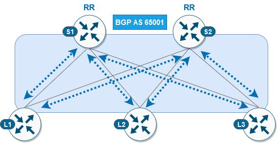

Task CFG01: Configure L2 EVPN connectivity with Spines
======================================================

.. image:: assets/cfg01_topology.png
    :align: center
    :class: margin-b-20

In this task, we will be configuring L2 connectivity in EVPN fabric. L2 connectivity will be extended across the leaf switches which will allow hosts connected to different leafs communicate with each other as they would be connected to same leaf. To achieve this, we will configure L2 VNI and hosts will be able to communicate within same L2 domain only.  

To get started, please select in ``lab manager`` option ``01`` to initialize lab devices.

.. note::

    At beginning of this task, underlay configuration was already preconfigured for you. This includes configuration of IGP - OSPF for loopback reachability and multicast routing to support flooding of broadcast  / multicast / unknown unicast (BUM) traffic.

Step 1: Configure L2VNP and VNI-EVI-VLAN stitching
**************************************************

We will start with L2VPN configuration. Configuration can be defined either in global context (l2vpn evpn) or per instance (l2vpn evpn instance …). In case that settings are not overridden in per instance context, they are inherited from global. 

First, we will define replication type based on which we will be flooding BUM traffic in the fabric. The BGP EVPN control plane uses two methods for this purpose: multicast based (static), where multicast is flooded over dedicated multicast group to rest of the leaf switches or unicast based (ingress replication - ingress), where BUM traffic is delivered to leaf switched over unicast. 

In this scenario, we will configure global context with replication type ingress (unicast based) and define two EVI instances – 101 and 102. Parameters of each EVI instance can be found in table below.
   
.. list-table::
    :widths: 25 25 25 25
    :header-rows: 1
    :width: 100%

    * - EVI
      - VLAN
      - VNI
      - Replication
    * - 101
      - 101
      - 10101
      - ingress (unicast)
    * - 102
      - 102
      - 10102
      - static (multicast)

.. image:: assets/cfg01_vni.png
    :align: center
    :class: margin-b-20

.. note::

    VXLAN encapsulation format is a default setting. 

    EVPN instance needs to be explicitly configured only when something needs to be configured per EVPN instance such as a route target, encapsulation or replication type.

L1/L2/L3 nodes

.. code-block:: console
    :linenos:
    :emphasize-lines: 6,9,13,15
    :class: emphasize-hll-12 emphasize-hll-17 emphasize-hll-24-2 emphasize-hll-27

    conf t
    !
    l2vpn evpn
     replication-type ingress
    !
    l2vpn evpn instance 101 vlan-based
     encapsulation vxlan
    !
    l2vpn evpn instance 102 vlan-based
     encapsulation vxlan
     replication-type static
    !
    vlan configuration 101
     member evpn-instance 101 vni 10101
    vlan configuration 102
     member evpn-instance 102 vni 10102

Step 2: Configure NVE interface
*******************************

Next, we have to configure network virtualization endpoint (NVE) interface. The NVE interface is logical interface where encapsulation and decapsulation of traffic happens for VXLAN traffic.  

Specified replication type defined on NVE interface have to match replication type on EVI instance. In case of multicast based replication (static), we have to define multicast group which will be used for flooding of BUM traffic. In case of unicast based replication (ingress), this is not needed since BGP control plane will built list of leafs where BUM traffic have to be replicated via unicast. 

L1/L2/L3 nodes

.. code-block:: console
    :linenos:

    conf t
    !
    interface nve1
     no ip address
     source-interface Loopback1
     host-reachability protocol bgp
     member vni 10101 ingress-replication
     member vni 10102 mcast-group 225.0.1.102

Step 3: Configure BGP
*********************

As last step, we will configure BGP protocol, so we can advertise host reachability information via L2VPN EVPN address family in fabric. In this scenario, both spine and leaf switches are part of same AS 65001 and spine switches are acting like route reflectors.

L1/L2/L3 node

.. code-block:: console
    :linenos:
    :emphasize-lines: 11

    conf t
    !
    router bgp 65001
     bgp router-id interface Lo0
     no bgp default ipv4-unicast
     neighbor 10.1.255.1 remote-as 65001
     neighbor 10.1.255.1 update-source Loopback0
     neighbor 10.1.255.2 remote-as 65001
     neighbor 10.1.255.2 update-source Loopback0
     !
     address-family l2vpn evpn
      neighbor 10.1.255.1 activate
      neighbor 10.1.255.1 send-community both
      neighbor 10.1.255.2 activate
      neighbor 10.1.255.2 send-community both

S1/S2 node

.. code-block:: console
    :linenos:
    :emphasize-lines: 13

    conf t
    !
    router bgp 65001
     bgp router-id interface Lo0
     no bgp default ipv4-unicast
     neighbor 10.1.255.3 remote-as 65001
     neighbor 10.1.255.3 update-source Loopback0
     neighbor 10.1.255.4 remote-as 65001
     neighbor 10.1.255.4 update-source Loopback0
     neighbor 10.1.255.5 remote-as 65001
     neighbor 10.1.255.5 update-source Loopback0
     !
     address-family l2vpn evpn
      neighbor 10.1.255.3 activate
      neighbor 10.1.255.3 send-community both
      neighbor 10.1.255.3 route-reflector-client
      neighbor 10.1.255.4 activate
      neighbor 10.1.255.4 send-community both
      neighbor 10.1.255.4 route-reflector-client
      neighbor 10.1.255.5 activate
      neighbor 10.1.255.5 send-community both
      neighbor 10.1.255.5 route-reflector-client

After completion of BGP configuration on both leaf and spine switches, we can verify status of BGP peering’s on spines. We should see that both spine switches have running BGP peering with all 3 leafs.

S1 node

.. code-block:: console
    :linenos:
    :emphasize-lines: 3,4,5
    :class: highlight-command

    cfg01-S1#sh bgp l2vpn evpn summary | beg Neighbor
    Neighbor        V           AS MsgRcvd MsgSent   TblVer  InQ OutQ Up/Down  State/PfxRcd
    10.1.255.3      4        65001    2936    2954       16    0    0 1d20h           0
    10.1.255.4      4        65001    2944    2950       16    0    0 1d20h           0
    10.1.255.5      4        65001    2936    2947       16    0    0 1d20h           0

S2 node

.. code-block:: console
    :linenos:
    :emphasize-lines: 3,4,5
    :class: highlight-command

    cfg01-S2#sh bgp l2vpn evpn summary | beg Neighbor
    Neighbor        V           AS MsgRcvd MsgSent   TblVer  InQ OutQ Up/Down  State/PfxRcd
    10.1.255.3      4        65001    2942    2951       16    0    0 1d20h           0
    10.1.255.4      4        65001    2941    2942       16    0    0 1d20h           0
    10.1.255.5      4        65001    2947    2952       16    0    0 1d20h           0

Step 4: Verification
********************

At this stage of the lab, we should be able to ping between hosts located in same subnet over vlan 101 (subnet 172.16.101.0/24) and vlan 102 (subnet 172.16.102.0/24).

H11 node

.. code-block:: console
    :linenos:
    :class: highlight-command highlight-command-14

    cfg01-H11#ping 172.16.101.11
    Type escape sequence to abort.
    Sending 5, 100-byte ICMP Echos to 172.16.101.11, timeout is 2 seconds:
    .!!!!
    Success rate is 80 percent (4/5), round-trip min/avg/max = 1/1/1 ms
    
    cfg01-H11#ping 172.16.101.12
    Type escape sequence to abort.
    Sending 5, 100-byte ICMP Echos to 172.16.101.12, timeout is 2 seconds:
    .!!!!
    Success rate is 80 percent (4/5), round-trip min/avg/max = 1/1/2 ms
    cfg01-H11#

H12 node

.. code-block:: console
    :linenos:
    :class: highlight-command highlight-command-14

    cfg01-H12#ping 172.16.102.11
    Type escape sequence to abort.
    Sending 5, 100-byte ICMP Echos to 172.16.102.11, timeout is 2 seconds:
    .!!!!
    Success rate is 80 percent (4/5), round-trip min/avg/max = 1/1/1 ms
    
    cfg01-H12#ping 172.16.102.12
    Type escape sequence to abort.
    Sending 5, 100-byte ICMP Echos to 172.16.102.12, timeout is 2 seconds:
    .!!!!
    Success rate is 80 percent (4/5), round-trip min/avg/max = 1/1/2 ms
    cfg01-H12#

As you can see on both hosts, host were able to learn remote MAC address via ARP resolution since ARP request/reply was flooded either via unicast or multicast, depending on replication method, in fabric.

.. note::

    In the outputs below, you can see that IP addresses 172.16.101.1 / 172.16.102.1 have ``incomplete`` ARP entry. These IP addresses are used as default gateways for their respective subnet. Purpose of this lab task is to demonstrate L2 connectivity, and these IP addresses will be added as part of next lab task, where we will be configuring L3 connectivity over fabric.

H11 node

.. code-block:: console
    :linenos:
    :emphasize-lines: 5,6
    :class: highlight-command

    cfg01-H11#show ip arp
    Protocol  Address          Age (min)  Hardware Addr   Type   Interface
    Internet  172.16.101.1            0   Incomplete      ARPA
    Internet  172.16.101.10           -   0000.0001.0101  ARPA   Ethernet0/0
    Internet  172.16.101.11           0   0000.0002.0101  ARPA   Ethernet0/0
    Internet  172.16.101.12           0   0000.0003.0101  ARPA   Ethernet0/0

H12 node

.. code-block:: console
    :linenos:
    :emphasize-lines: 5,6
    :class: highlight-command

    cfg01-H12#show ip arp
    Protocol  Address          Age (min)  Hardware Addr   Type   Interface
    Internet  172.16.102.1            0   Incomplete      ARPA
    Internet  172.16.102.10           -   0000.0001.0102  ARPA   Ethernet0/0
    Internet  172.16.102.11           0   0000.0002.0102  ARPA   Ethernet0/0
    Internet  172.16.102.12           0   0000.0003.0102  ARPA   Ethernet0/0

Let’s verify also control plane state on leaf switches. As you can see below, NVE peers been discovered over L2 VNI. Please note that type L2CP indicate that it is used for L2 connectivity.

L1 node

.. code-block:: console
    :linenos:
    :class: highlight-command

    cfg01-L1#show nve peers
    'M' - MAC entry download flag  'A' - Adjacency download flag
    '4' - IPv4 flag  '6' - IPv6 flag

    Interface  VNI      Type Peer-IP          RMAC/Num_RTs   eVNI     state flags UP time
    nve1       10101    L2CP 10.1.254.4       3              10101      UP   N/A  1d19h
    nve1       10101    L2CP 10.1.254.5       3              10101      UP   N/A  1d19h
    nve1       10102    L2CP 10.1.254.4       2              10102      UP   N/A  1d19h
    nve1       10102    L2CP 10.1.254.5       2              10102      UP   N/A  1d19h

Based on the available routes in BGP protocol, device will populate l2route table with locally originated routes (L2VPN flag) and remote learned routes (BGP flag). We can see also information about associated EVI instance and next hop information including VNI and remote peer IP address in case of remote entry. 

L1 node

.. code-block:: console
    :linenos:
    :class: highlight-command

    cfg01-L1#show l2route evpn mac ip
    EVI       ETag  Prod    Mac Address         Host IP                Next Hop(s)
    ----- ---------- ----- -------------- --------------- --------------------------
    101          0 L2VPN 0000.0001.0101   172.16.101.10                  Et1/1:101
    101          0   BGP 0000.0002.0101   172.16.101.11         V:10101 10.1.254.4
    101          0   BGP 0000.0003.0101   172.16.101.12         V:10101 10.1.254.5
    102          0 L2VPN 0000.0001.0102   172.16.102.10                  Et1/2:102
    102          0   BGP 0000.0002.0102   172.16.102.11         V:10102 10.1.254.4
    102          0   BGP 0000.0003.0102   172.16.102.12         V:10102 10.1.254.5
