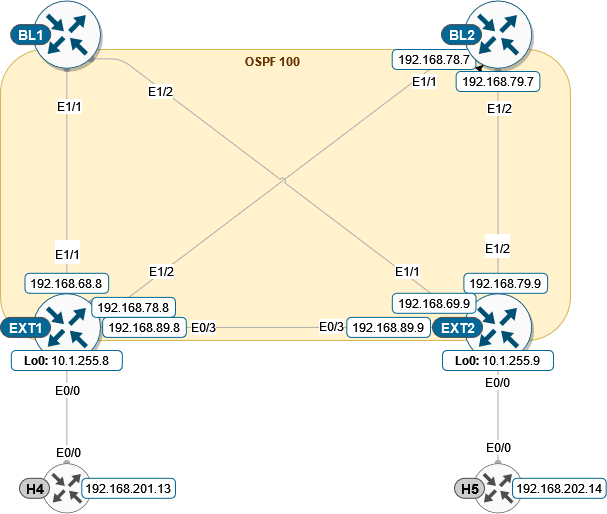

Task CFG02: Configure Border Leafs and L3 routing between external network and Fabric
=====================================================================================

.. image:: assets/cfg02_topology.png
    :align: center

In this task we are configuring the more complex topology with a connectivity between fabric and external networks, using the Border Leaf switches.

.. note::

    External connectivity allows the movement of Layer 2 and Layer 3 traffic between an EVPN VXLAN network and an external network. It also enables the EVPN VXLAN network to exchange routes with the externally connected network. 

    Routes within an EVPN VXLAN network are already shared between all the VTEPs/Leafs. 

    External connectivity uses the Leafs on the periphery of the network to pass on these routes to an external Layer 2 or Layer 3 network. Similarly, the EVPN VXLAN network imports the reachability routes from the external network.

To get started, please select in ``lab manager`` option ``02`` to initialize lab devices.

.. note::

    At the beginning of the task Border Leafs are fully integrated to the fabric, External network is configured.

    L3 interfaces in a dedicated VRF “green” are used on Border Leafs for external connectivity between borders and external nodes.

Step 1: Add IP interfaces to BL1/2 and EXT1/2
*********************************************

First, we need to configure underlay and OSPF for routes exchange (area 0 is used for the lab scenario). Note that Border Leaf 1 and 2 interfaces towards EXT nodes are part of VRF “green”.

EXT1 node

.. code-block::

    conf t
    !
    interface e1/1
     no sw
     no shut
     ip addr 192.168.68.8 255.255.255.0
     ip ospf 100 area 0
     ip ospf net point-to-point
    !
    interface e1/2
     no sw
     no shut
     ip addr 192.168.78.8 255.255.255.0
     ip ospf 100 area 0
     ip ospf net point-to-point

