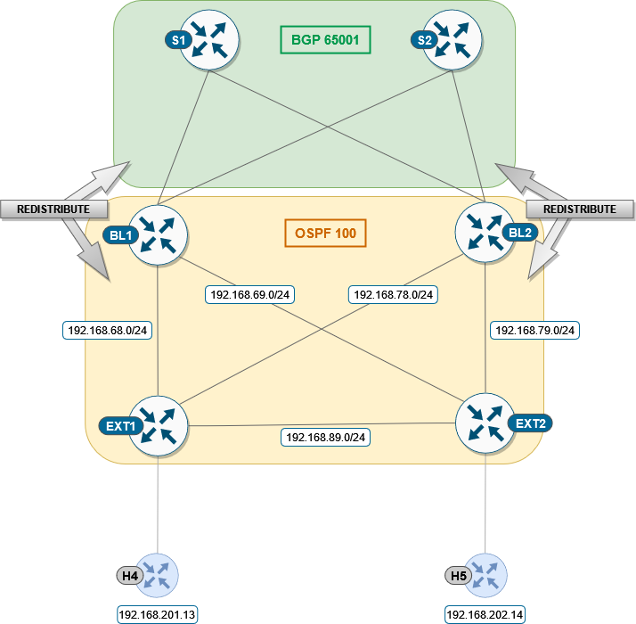

Task CFG03: Configure L3 connectivity between external network and fabric
=========================================================================

In this task we are configuring the more complex topology with a connectivity between fabric and external networks, using the Border Leaf switches.

.. note::

    External connectivity allows the movement of Layer 2 and Layer 3 traffic between an EVPN VXLAN network and an external network. It also enables the EVPN VXLAN network to exchange routes with the externally connected network. 

    Routes within an EVPN VXLAN network are already shared between all the VTEPs/Leafs. 

    External connectivity uses the Leafs on the periphery of the network to pass on these routes to an external Layer 2 or Layer 3 network. Similarly, the EVPN VXLAN network imports the reachability routes from the external network.

To get started, please select in ``lab manager`` option ``03`` to initialize lab devices.

.. note::

    At the beginning of the task Border Leafs are fully integrated to the fabric, External network is configured.

    L3 interfaces in a dedicated VRF “green” are used on Border Leafs for external connectivity between borders and external nodes.

Step 1: Configure routing between BL1/2 and EXT1/2
**************************************************

First, we need to configure underlay and OSPF for routes exchange (area 0 is used for the lab scenario). Note that Border Leaf 1 and 2 interfaces towards EXT nodes are part of VRF “green”.

EXT1 node

.. code-block:: console
    :linenos:

    conf t
    !
    interface e1/1
     no sw
     no shut
     ip addr 192.168.68.8 255.255.255.0
     ip ospf 100 area 0
     ip ospf net point-to-point
    !
    interface e1/2
     no sw
     no shut
     ip addr 192.168.78.8 255.255.255.0
     ip ospf 100 area 0
     ip ospf net point-to-point

EXT2 node

.. code-block:: console
    :linenos:

    conf t
    !
    interface e1/1
     no sw
     no shut
     ip addr 192.168.69.9 255.255.255.0
     ip ospf 100 area 0
     ip ospf net point-to-point
    !
    interface e1/2
     no sw
     no shut
     ip addr 192.168.79.9 255.255.255.0
     ip ospf 100 area 0
     ip ospf net point-to-point

BL1 node

.. code-block:: console
    :linenos:

    conf t
    !
    router ospf 100 vrf green
     router-id 172.16.255.6
    !
    interface e1/1
     no sw
     no shut
     vrf for green
     ip addr 192.168.68.6 255.255.255.0
     ip ospf 100 area 0
     ip ospf net point-to-point
    !
    interface e1/2
     no sw
     no shut
     vrf for green
     ip addr 192.168.69.6 255.255.255.0
     ip ospf 100 area 0
     ip ospf net point-to-point

BL2 node

.. code-block:: console
    :linenos:

    conf t
    !
    router ospf 100 vrf green
     router-id 172.16.255.7
    !
    interface e1/1
     no sw
     no shut
     vrf for green
     ip addr 192.168.78.7 255.255.255.0
     ip ospf 100 area 0
     ip ospf net point-to-point
    !
    interface e1/2
     no sw
     no shut
     vrf for green
     ip addr 192.168.79.7 255.255.255.0
     ip ospf 100 area 0
     ip ospf net point-to-point

To verify that OSPF is converged properly, check the neighborship status and routes exchange:

BL1 node

.. code-block:: console
    :linenos:
    :class: highlight-command highlight-command-12

    cfg03-BL1#show ip ospf 100 neighbor
    Neighbor ID     Pri   State           Dead Time   Address         Interface
    192.168.255.9     0   FULL/  -        00:00:30    192.168.69.9    Ethernet1/2
    192.168.255.8     0   FULL/  -        00:00:35    192.168.68.8    Ethernet1/1

    cfg03-BL1#show ip route vrf green ospf | begin Gateway
    O     192.168.78.0/24 [110/20] via 192.168.68.8, 00:02:34, Ethernet1/1
    O     192.168.79.0/24 [110/20] via 192.168.69.9, 00:02:31, Ethernet1/2
    O     192.168.89.0/24 [110/20] via 192.168.69.9, 00:02:31, Ethernet1/2
                          [110/20] via 192.168.68.8, 00:02:34, Ethernet1/1
    O IA  192.168.201.0/24 [110/11] via 192.168.68.8, 00:02:34, Ethernet1/1
    O IA  192.168.202.0/24 [110/11] via 192.168.69.9, 00:02:31, Ethernet1/2
        192.168.255.0/32 is subnetted, 2 subnets
    O        192.168.255.8 [110/11] via 192.168.68.8, 00:02:34, Ethernet1/1
    O        192.168.255.9 [110/11] via 192.168.69.9, 00:02:31, Ethernet1/2

BL2 node 

.. code-block:: console
    :linenos:
    :class: highlight-command highlight-command-12

    cfg03-BL2#show ip ospf 100 neighbor
    Neighbor ID     Pri   State           Dead Time   Address         Interface
    192.168.255.9     0   FULL/  -        00:00:34    192.168.79.9    Ethernet1/2
    192.168.255.8     0   FULL/  -        00:00:31    192.168.78.8    Ethernet1/1

    cfg03-BL2#show ip route vrf green ospf | begin Gateway
    O     192.168.68.0/24 [110/20] via 192.168.78.8, 00:08:40, Ethernet1/1
    O     192.168.69.0/24 [110/20] via 192.168.79.9, 00:08:36, Ethernet1/2
    O     192.168.89.0/24 [110/20] via 192.168.79.9, 00:08:36, Ethernet1/2
                          [110/20] via 192.168.78.8, 00:08:40, Ethernet1/1
    O IA  192.168.201.0/24 [110/11] via 192.168.78.8, 00:08:40, Ethernet1/1
    O IA  192.168.202.0/24 [110/11] via 192.168.79.9, 00:08:36, Ethernet1/2
        192.168.255.0/32 is subnetted, 2 subnets
    O        192.168.255.8 [110/11] via 192.168.78.8, 00:08:40, Ethernet1/1
    O        192.168.255.9 [110/11] via 192.168.79.9, 00:08:36, Ethernet1/2

EXT1 node

.. code-block:: console
    :linenos:
    :class: highlight-command

    cfg03-EXT1#show ip ospf neighbor
    Neighbor ID     Pri   State           Dead Time   Address         Interface
    172.16.255.7      0   FULL/  -        00:00:32    192.168.78.7    Ethernet1/2
    172.16.255.6      0   FULL/  -        00:00:33    192.168.68.6    Ethernet1/1
    192.168.255.9     0   FULL/  -        00:00:34    192.168.89.9    Ethernet0/3

EXT2 node

.. code-block:: console
    :linenos:
    :class: highlight-command

    cfg03-EXT2#show ip ospf neighbor
    Neighbor ID     Pri   State           Dead Time   Address         Interface
    172.16.255.7      0   FULL/  -        00:00:34    192.168.79.7    Ethernet1/2
    172.16.255.6      0   FULL/  -        00:00:32    192.168.69.6    Ethernet1/1
    192.168.255.8     0   FULL/  -        00:00:39    192.168.89.8    Ethernet0/3

Step 2: Redistribute OSPF 100 to BGP 65001 and vice versa on BL1/2
******************************************************************

Next, redistribution of between OSPF and BGP has to be done on the Border Leafs. Such redistribution of the IGP is required in the BGP VRF address family to distribute the external prefixes into the BGP EVPN VXLAN fabric.

BL1/BL2 node

.. code-block:: console
    :linenos:

    conf t
    router ospf 100 vrf green
     redistr bgp 65001 subnets
    !
    router bgp 65001
     add ipv4 uni vrf green
      redistribute ospf 100

Once we configured redistribution between OSPF and BGP, we can see on EXT devices host /32 routes from the fabric. 

EXT1 node

.. code-block:: console
    :linenos:
    :class: highlight-command
    
    cfg03-EXT1#show ip route 172.16.0.0 255.255.0.0 longer-prefixes

        172.16.0.0/32 is subnetted, 6 subnets
    O E2     172.16.101.10 [110/1] via 192.168.78.7, 00:01:23, Ethernet1/2
                           [110/1] via 192.168.68.6, 00:01:29, Ethernet1/1
    O E2     172.16.101.11 [110/1] via 192.168.78.7, 00:01:23, Ethernet1/2
                           [110/1] via 192.168.68.6, 00:01:29, Ethernet1/1
    O E2     172.16.101.12 [110/1] via 192.168.78.7, 00:01:23, Ethernet1/2
                           [110/1] via 192.168.68.6, 00:01:29, Ethernet1/1
    O E2     172.16.102.10 [110/1] via 192.168.78.7, 00:01:23, Ethernet1/2
                           [110/1] via 192.168.68.6, 00:01:29, Ethernet1/1
    O E2     172.16.102.11 [110/1] via 192.168.78.7, 00:01:23, Ethernet1/2
                           [110/1] via 192.168.68.6, 00:01:29, Ethernet1/1
    O E2     172.16.102.12 [110/1] via 192.168.78.7, 00:01:23, Ethernet1/2
                           [110/1] via 192.168.68.6, 00:01:29, Ethernet1/1

EXT2 node

.. code-block:: console
    :linenos:
    :class: highlight-command

    cfg03-EXT2#show ip route 172.16.0.0 255.255.0.0 longer-prefixes

        172.16.0.0/32 is subnetted, 6 subnets
    O E2     172.16.101.10 [110/1] via 192.168.79.7, 00:01:59, Ethernet1/2
                           [110/1] via 192.168.69.6, 00:02:05, Ethernet1/1
    O E2     172.16.101.11 [110/1] via 192.168.79.7, 00:01:59, Ethernet1/2
                           [110/1] via 192.168.69.6, 00:02:05, Ethernet1/1
    O E2     172.16.101.12 [110/1] via 192.168.79.7, 00:01:59, Ethernet1/2
                           [110/1] via 192.168.69.6, 00:02:05, Ethernet1/1
    O E2     172.16.102.10 [110/1] via 192.168.79.7, 00:01:59, Ethernet1/2
                           [110/1] via 192.168.69.6, 00:02:05, Ethernet1/1
    O E2     172.16.102.11 [110/1] via 192.168.79.7, 00:01:59, Ethernet1/2
                           [110/1] via 192.168.69.6, 00:02:05, Ethernet1/1
    O E2     172.16.102.12 [110/1] via 192.168.79.7, 00:01:59, Ethernet1/2
                           [110/1] via 192.168.69.6, 00:02:05, Ethernet1/1

Step 3: Configure the BGP aggregation route-map
***********************************************

Redistribution of all host routes in fabric to external network may not be always desired since it can significantly increase size of routing table in external network depending on number of hosts in fabric. Therefore, we will implement aggregation of these routes in BGP for VRF ``green`` and we will aggregate all /32 routes under single /16 route.

BL1/BL2 nodes

.. code-block:: console
    :linenos:

    conf t
    !
    router bgp 65001
     add ipv4 uni vrf green
      aggregate-address 172.16.0.0 255.255.0.0 summary-only
    !
    ip prefix-list PL-BGP-TO-OSPF permit 172.16.0.0/16
    !
    route-map RM-BGP-TO-OSPF p 10
     match ip address prefix-list PL-BGP-TO-OSPF
    !
    router ospf 100 vrf green
     redistribute bgp 65001 route-map RM-BGP-TO-OSPF

After we updated our configuration of redistribution, we can see that EXT devices now holds only single /16 route, which aggregates host /32 routes from fabric.

.. note:: 

    It may take few seconds till aggregate route will appear in routing table. 

EXT1 node

.. code-block:: console
    :linenos:
    :class: highlight-command

    cfg03-EXT1#show ip route 172.16.0.0 255.255.0.0 longer-prefixes

    O E2  172.16.0.0/16 [110/1] via 192.168.78.7, 00:00:25, Ethernet1/2
                        [110/1] via 192.168.68.6, 00:00:25, Ethernet1/1

EXT2 node

.. code-block:: console
    :linenos:
    :class: highlight-command

    cfg03-EXT2#show ip route 172.16.0.0 255.255.0.0 longer-prefixes

    O E2  172.16.0.0/16 [110/1] via 192.168.79.7, 00:00:38, Ethernet1/2
                        [110/1] via 192.168.69.6, 00:00:38, Ethernet1/1

Step 4: Verification
********************

At the end of the task the connectivity should be established between hosts in the fabric (Hosts 1X/2X/3X) and Hosts in the external network (Hosts 4/5), which you can verify with the ping test, e.g. from Host 1 to Host 4:

H11 node

.. code-block:: console
    :linenos:
    :class: highlight-command highlight-command-14

    cfg03-H11#ping 192.168.201.13
    Type escape sequence to abort.
    Sending 5, 100-byte ICMP Echos to 192.168.201.13, timeout is 2 seconds:
    .!!!!
    Success rate is 80 percent (4/5), round-trip min/avg/max = 1/1/2 ms

    cfg03-H11#ping 192.168.202.14
    Type escape sequence to abort.
    Sending 5, 100-byte ICMP Echos to 192.168.202.14, timeout is 2 seconds:
    .!!!!
    Success rate is 80 percent (4/5), round-trip min/avg/max = 1/1/2 ms

Also, connectivity could be verified to the loopback of the external routers EXT1 and EXT2:

H11 node

.. code-block:: console
    :linenos:
    :class: highlight-command highlight-command-14

    cfg03-H11#ping 192.168.255.8
    Type escape sequence to abort.
    Sending 5, 100-byte ICMP Echos to 192.168.255.8, timeout is 2 seconds:
    !!!!!
    Success rate is 100 percent (5/5), round-trip min/avg/max = 1/1/1 ms
    
    cfg03-H11#ping 192.168.255.9
    Type escape sequence to abort.
    Sending 5, 100-byte ICMP Echos to 192.168.255.9, timeout is 2 seconds:
    !!!!!
    Success rate is 100 percent (5/5), round-trip min/avg/max = 1/1/1 ms

Additionally, you can check routing information.

EXT1 node 

.. code-block:: console
    :linenos:
    :class: highlight-command

    cfg03-EXT1#show ip route ospf | begin Gateway
    Gateway of last resort is not set

    O E2  172.16.0.0/16 [110/1] via 192.168.78.7, 00:00:27, Ethernet1/2
                        [110/1] via 192.168.68.6, 00:00:27, Ethernet1/1
    O     192.168.69.0/24 [110/20] via 192.168.89.9, 00:22:48, Ethernet0/3
                          [110/20] via 192.168.68.6, 00:14:08, Ethernet1/1
    O     192.168.79.0/24 [110/20] via 192.168.89.9, 00:22:48, Ethernet0/3
                          [110/20] via 192.168.78.7, 00:13:29, Ethernet1/2
        192.168.255.0/32 is subnetted, 2 subnets
    O        192.168.255.9 [110/11] via 192.168.89.9, 00:22:48, Ethernet0/3

EXT2 node 

.. code-block:: console
    :linenos:
    :class: highlight-command

    cfg03-EXT2#show ip route ospf | begin Gateway
    Gateway of last resort is not set

    O E2  172.16.0.0/16 [110/1] via 192.168.79.7, 00:00:58, Ethernet1/2
                        [110/1] via 192.168.69.6, 00:00:58, Ethernet1/1
    O     192.168.68.0/24 [110/20] via 192.168.89.8, 00:23:40, Ethernet0/3
                          [110/20] via 192.168.69.6, 00:14:36, Ethernet1/1
    O     192.168.78.0/24 [110/20] via 192.168.89.8, 00:23:40, Ethernet0/3
                          [110/20] via 192.168.79.7, 00:13:57, Ethernet1/2
    O IA  192.168.201.0/24 [110/11] via 192.168.89.8, 00:23:19, Ethernet0/3
        192.168.255.0/32 is subnetted, 2 subnets
    O        192.168.255.8 [110/11] via 192.168.89.8, 00:23:40, Ethernet0/3

BL1 node

.. code-block:: console
    :linenos:
    :class: highlight-command

    cfg03-BL1#show bgp l2vpn evpn | include \[5\]
    *>   [5][1:1][0][16][172.16.0.0]/17
    *>   [5][1:1][0][24][192.168.68.0]/17
    *>   [5][1:1][0][24][192.168.69.0]/17
    * i  [5][1:1][0][24][192.168.78.0]/17
    * i  [5][1:1][0][24][192.168.79.0]/17
    *>   [5][1:1][0][24][192.168.89.0]/17
    *>   [5][1:1][0][24][192.168.201.0]/17
    *>   [5][1:1][0][32][192.168.255.8]/17
    *>   [5][1:1][0][32][192.168.255.9]/17

BL2 node

.. code-block:: console
    :linenos:
    :class: highlight-command

    cfg03-BL2#show bgp l2vpn evpn | include \[5\]
    *>   [5][1:1][0][16][172.16.0.0]/17
    *>   [5][1:1][0][24][192.168.68.0]/17
    *>   [5][1:1][0][24][192.168.69.0]/17
    *>   [5][1:1][0][24][192.168.78.0]/17
    *>   [5][1:1][0][24][192.168.79.0]/17
    *>   [5][1:1][0][24][192.168.89.0]/17
    *>   [5][1:1][0][24][192.168.201.0]/17
    *>   [5][1:1][0][32][192.168.255.8]/17
    *>   [5][1:1][0][32][192.168.255.9]/17

L1 node 

.. code-block:: console
    :linenos:
    :class: highlight-command

    cfg03-L1#show ip route vrf green bgp | begin Gateway
    Gateway of last resort is not set

        172.16.0.0/16 is variably subnetted, 9 subnets, 3 masks
    B        172.16.0.0/16 [200/0] via 10.1.254.6, 00:04:13, Vlan901
    B        172.16.101.11/32 [200/0] via 10.1.254.4, 00:17:00, Vlan901
    B        172.16.101.12/32 [200/0] via 10.1.254.5, 00:17:00, Vlan901
    B        172.16.102.11/32 [200/0] via 10.1.254.4, 00:17:00, Vlan901
    B        172.16.102.12/32 [200/0] via 10.1.254.5, 00:17:00, Vlan901
    B     192.168.68.0/24 [200/0] via 10.1.254.6, 00:05:33, Vlan901
    B     192.168.69.0/24 [200/0] via 10.1.254.6, 00:05:33, Vlan901
    B     192.168.78.0/24 [200/0] via 10.1.254.7, 00:05:20, Vlan901
    B     192.168.79.0/24 [200/0] via 10.1.254.7, 00:05:20, Vlan901
    B     192.168.89.0/24 [200/20] via 10.1.254.6, 00:05:33, Vlan901
    B     192.168.201.0/24 [200/11] via 10.1.254.6, 00:05:33, Vlan901
        192.168.255.0/32 is subnetted, 2 subnets
    B        192.168.255.8 [200/11] via 10.1.254.6, 00:05:33, Vlan901
    B        192.168.255.9 [200/11] via 10.1.254.6, 00:05:33, Vlan901

L2 node 

.. code-block:: console
    :linenos:
    :class: highlight-command

    cfg03-L2#show ip route vrf green bgp | begin Gateway
    Gateway of last resort is not set

        172.16.0.0/16 is variably subnetted, 9 subnets, 3 masks
    B        172.16.0.0/16 [200/0] via 10.1.254.6, 00:04:55, Vlan901
    B        172.16.101.10/32 [200/0] via 10.1.254.3, 00:22:43, Vlan901
    B        172.16.101.12/32 [200/0] via 10.1.254.5, 00:17:42, Vlan901
    B        172.16.102.10/32 [200/0] via 10.1.254.3, 00:22:43, Vlan901
    B        172.16.102.12/32 [200/0] via 10.1.254.5, 00:17:42, Vlan901
    B     192.168.68.0/24 [200/0] via 10.1.254.6, 00:06:15, Vlan901
    B     192.168.69.0/24 [200/0] via 10.1.254.6, 00:06:15, Vlan901
    B     192.168.78.0/24 [200/0] via 10.1.254.7, 00:06:02, Vlan901
    B     192.168.79.0/24 [200/0] via 10.1.254.7, 00:06:02, Vlan901
    B     192.168.89.0/24 [200/20] via 10.1.254.6, 00:06:15, Vlan901
    B     192.168.201.0/24 [200/11] via 10.1.254.6, 00:06:15, Vlan901
        192.168.255.0/32 is subnetted, 2 subnets
    B        192.168.255.8 [200/11] via 10.1.254.6, 00:06:15, Vlan901
    B        192.168.255.9 [200/11] via 10.1.254.6, 00:06:15, Vlan901

L3 node 

.. code-block:: console
    :linenos:
    :class: highlight-command

    cfg03-L3#show ip route vrf green bgp | begin Gateway
    Gateway of last resort is not set

        172.16.0.0/16 is variably subnetted, 9 subnets, 3 masks
    B        172.16.0.0/16 [200/0] via 10.1.254.6, 00:05:30, Vlan901
    B        172.16.101.10/32 [200/0] via 10.1.254.3, 00:23:18, Vlan901
    B        172.16.101.11/32 [200/0] via 10.1.254.4, 00:18:17, Vlan901
    B        172.16.102.10/32 [200/0] via 10.1.254.3, 00:23:18, Vlan901
    B        172.16.102.11/32 [200/0] via 10.1.254.4, 00:18:17, Vlan901
    B     192.168.68.0/24 [200/0] via 10.1.254.6, 00:06:50, Vlan901
    B     192.168.69.0/24 [200/0] via 10.1.254.6, 00:06:50, Vlan901
    B     192.168.78.0/24 [200/0] via 10.1.254.7, 00:06:37, Vlan901
    B     192.168.79.0/24 [200/0] via 10.1.254.7, 00:06:37, Vlan901
    B     192.168.89.0/24 [200/20] via 10.1.254.6, 00:06:50, Vlan901
    B     192.168.201.0/24 [200/11] via 10.1.254.6, 00:06:50, Vlan901
        192.168.255.0/32 is subnetted, 2 subnets
    B        192.168.255.8 [200/11] via 10.1.254.6, 00:06:50, Vlan901
    B        192.168.255.9 [200/11] via 10.1.254.6, 00:06:50, Vlan901
